# Задачи на программирование

## Задание А

Реализация api находится [тут](api.py)  

Запустить можно вот так:
1. Установите `fastapi`, `uvicorn`, выполнив команды
```
$ pip install fastapi
$ pip install "uvicorn[standard]"
```
2. Из корня `hw2` выполните:
```
$ uvicorn api:app --reload
```

## Задание Б
1. Создаю продукт 0
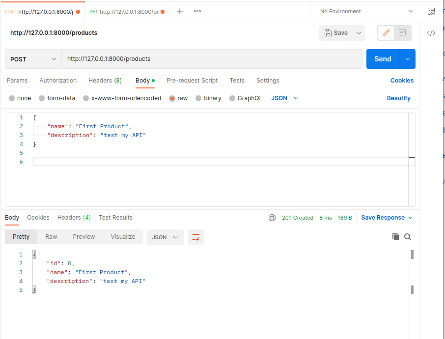  

2. Удаляю продукт 0
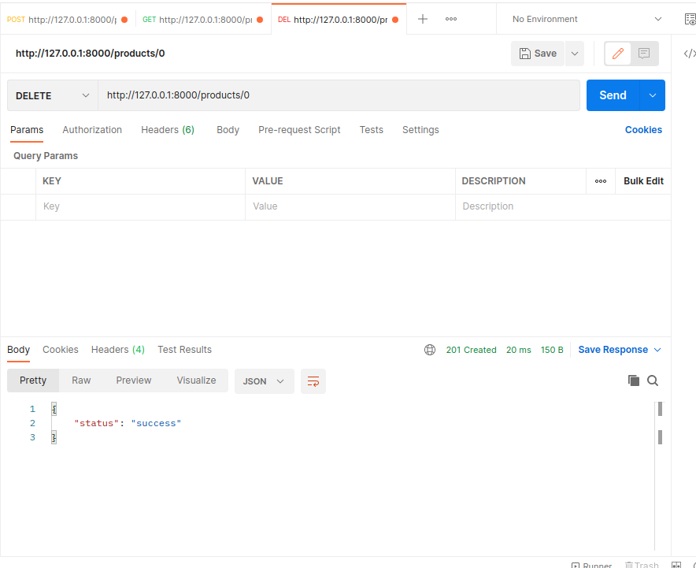 

3. Удаляю несуществующий продукт 1  
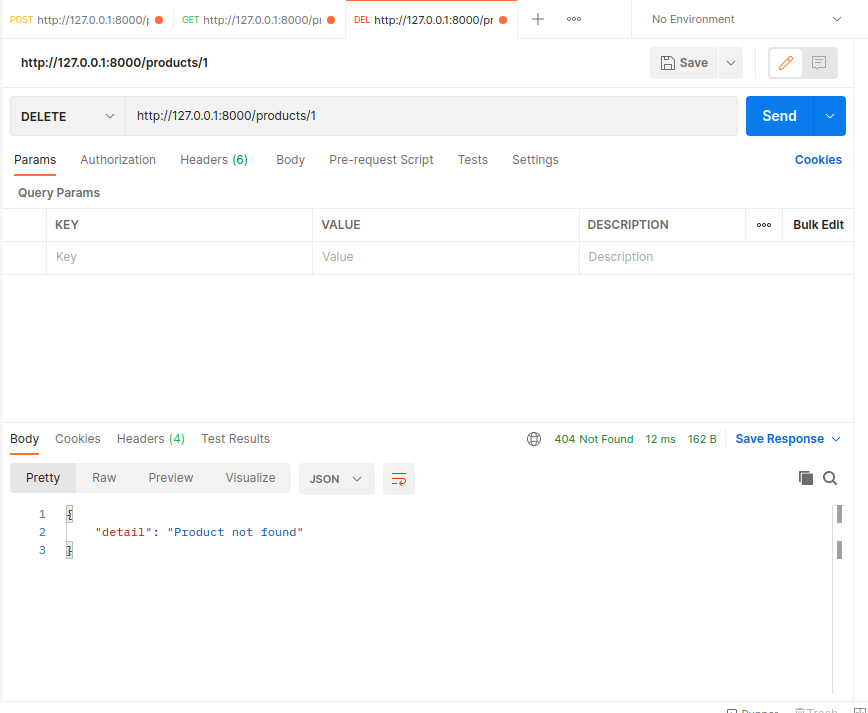 

4. Создаю продукт 1  
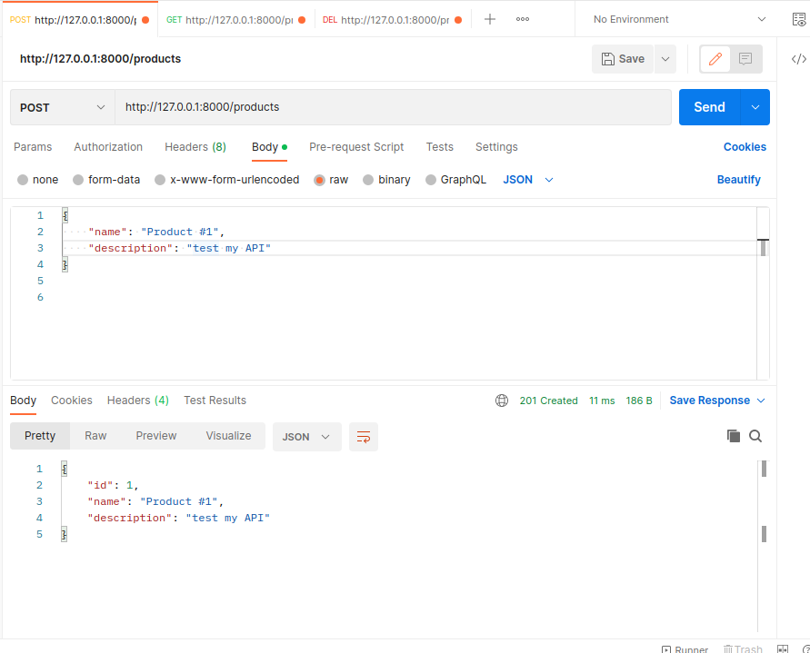 
   
5. Создаю продукт 2  
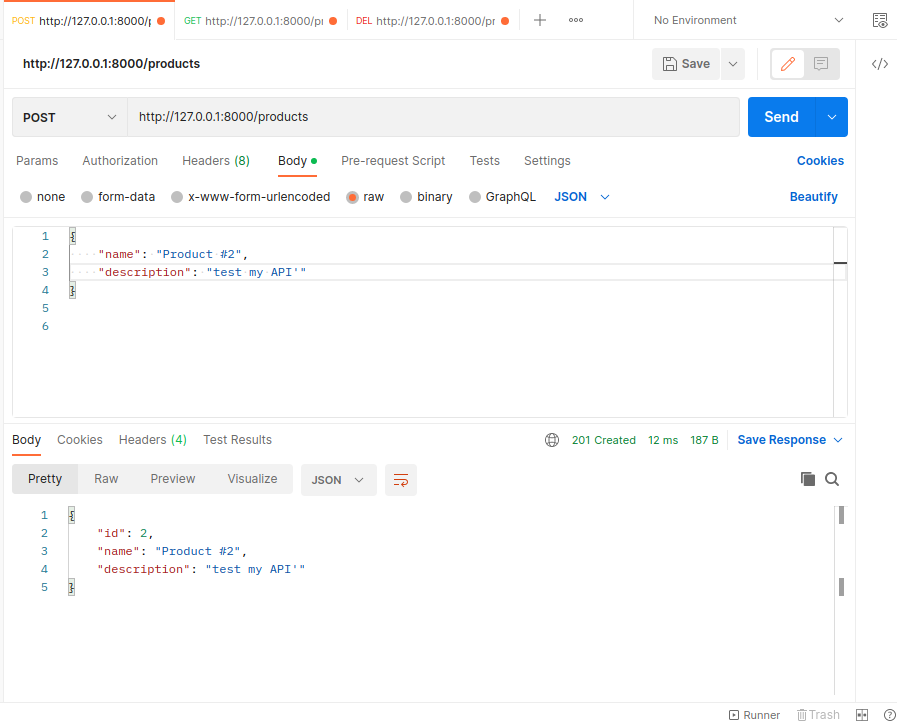 
   
6. Получаю все продукты 
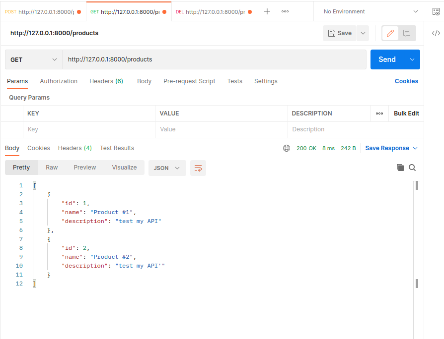  
   
7. Получаю продукт 2  
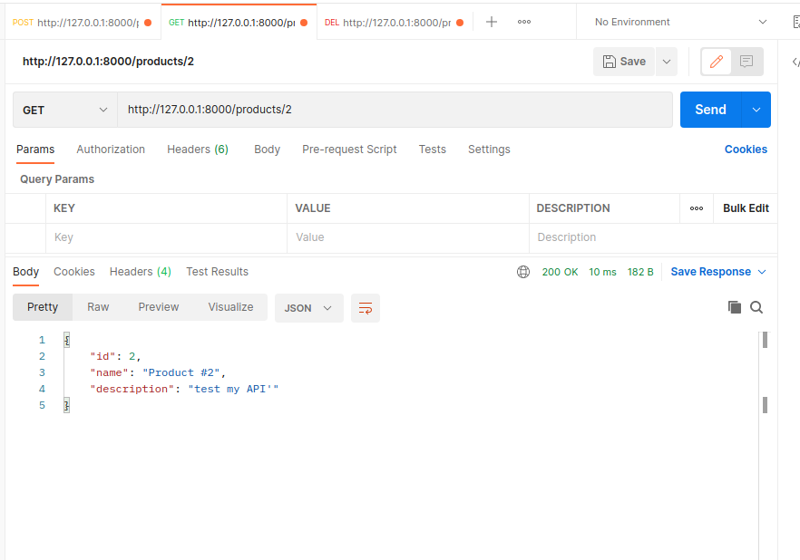 
   
8. Получаю несуществующий продукт 0  
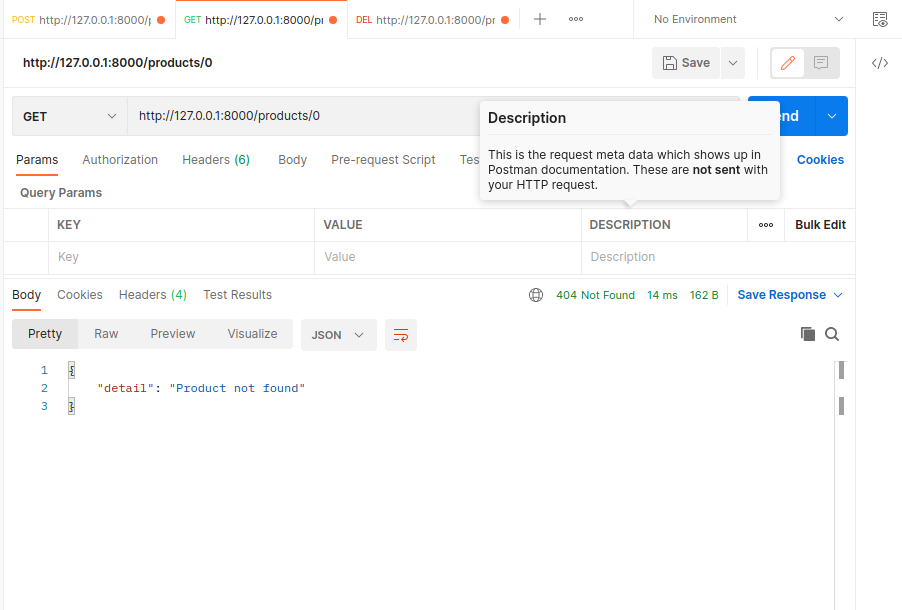 

9.  Обновляю продукт 1  
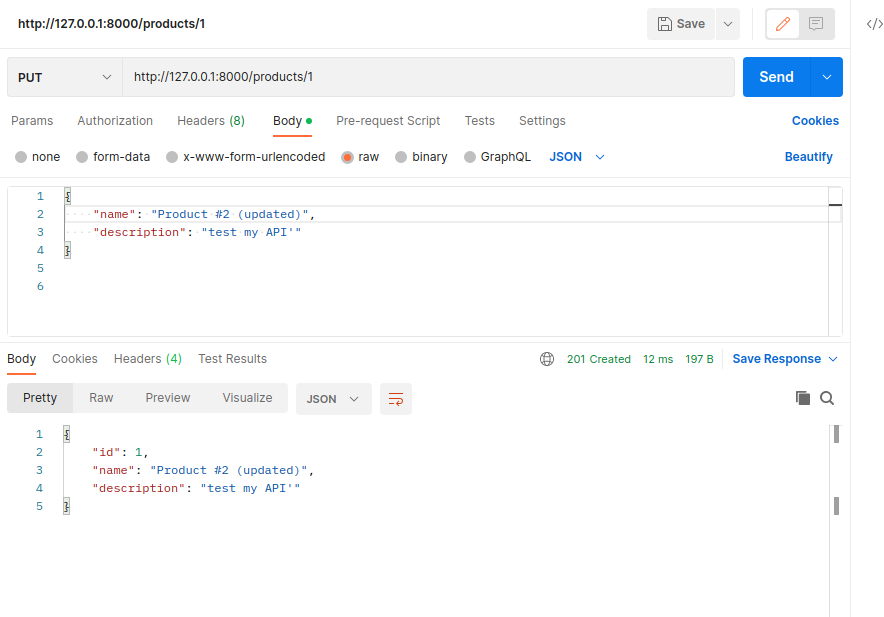 
    
10. Получаю продукт 1  
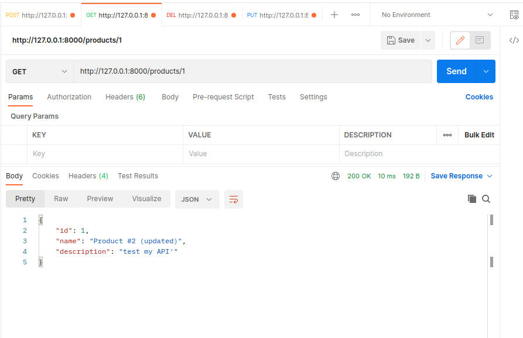 
    
11. Удаляю продукт 1  
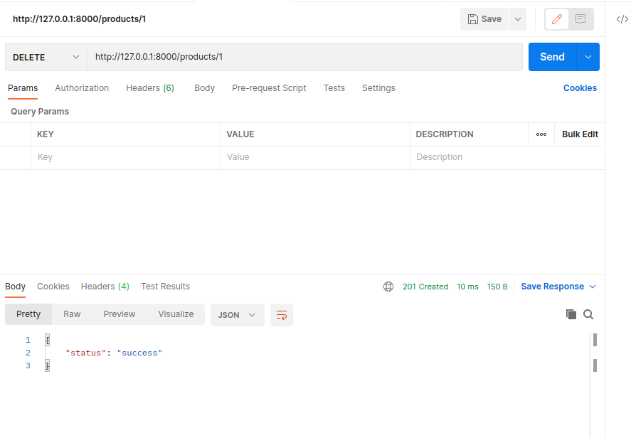 
    
12. Удаляю продукт 2  
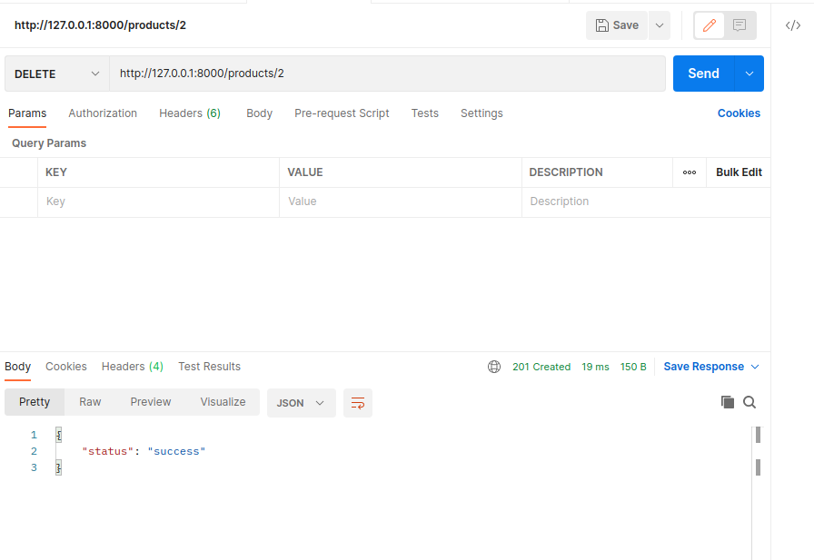 
    
13. Получаю все продукты
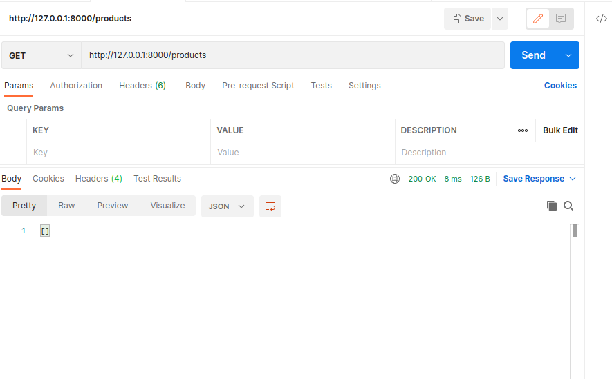 

