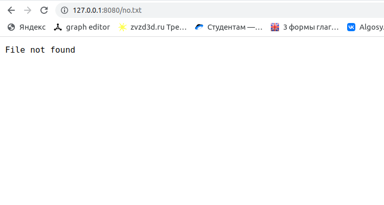

## Практические задания

[Код сервера](server/main.go)
[Код клиента](client/main.go)  
Код дополнен комментариями. Для распараллеливания используются горутины.
### Запуск  
1. Запустить сервер можно следующими командами из этой папки
```console
go build -o <BinaryName> server/main.go #gosetup
./<BinaryName>
```
Аргументы:
```
--dir директория, считаемая корнем сервера
--cl  concurrency level, максимальное число обрабатывающихся соединений параллельно
```
2. Запустить клиент вот так
```
go build -o <BinaryName> client/main.go #gosetup
./<BinaryName>
```
Аргументы:
```
--host хост
--port порт
--fl   путь
```
Для того, чтобы это было только задание можно поставить `cl=1` серверу.
### Демонстрация 
Запустим сервер и попробуем получить из браузера файлы A.txt/B.txt, а также несуществующий в моей директории no.txt
Получим результаты:


